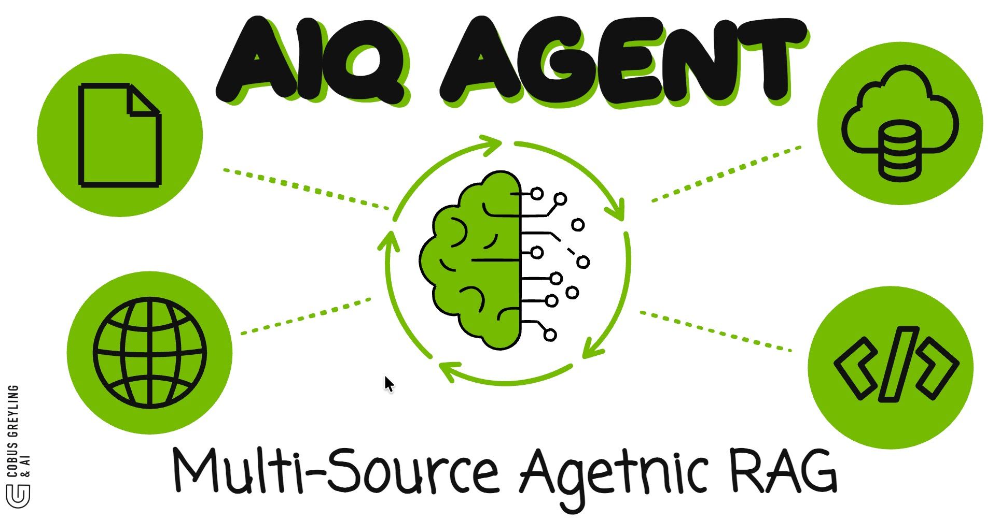

<p align="center">
  
</p>

<p align="center"><strong>Enterprise Agentic RAG with Multi-Source Reasoning — Powered by NVIDIA NIM & LangChain</strong></p>

An open-source implementation inspired by NVIDIA's AI-Q blueprint. NeMo AgentIQ autonomously selects data sources, plans query strategy, and synthesises cited answers with full reasoning traces — while cutting inference costs via a hybrid large/small model approach.

---

## Architecture

```
┌─────────────────────────────────────────────────────┐
│                   USER QUERY                         │
└──────────────────────┬──────────────────────────────┘
                       ▼
┌─────────────────────────────────────────────────────┐
│            ORCHESTRATOR AGENT                        │
│         (LangGraph + LangChain)                     │
│                                                      │
│  • Plans query strategy                              │
│  • Selects data sources                              │
│  • Decides analysis depth                            │
│  • Routes to sub-agents                              │
│                                                      │
│  Model: NVIDIA Nemotron-4-340B (via NVIDIA NIM)     │
└──────┬─────────┬──────────┬────────────┬────────────┘
       ▼         ▼          ▼            ▼
┌──────────┐ ┌────────┐ ┌────────┐ ┌──────────┐
│ DOC RAG  │ │ SQL    │ │ WEB    │ │ API      │
│ AGENT    │ │ AGENT  │ │ AGENT  │ │ AGENT    │
│          │ │        │ │        │ │          │
│LangChain │ │LangCh. │ │LangCh.│ │LangChain │
│Retriever │ │SQL Tool│ │Search  │ │Tool Call │
└────┬─────┘ └───┬────┘ └───┬────┘ └────┬─────┘
     ▼           ▼          ▼            ▼
┌──────────┐ ┌────────┐ ┌────────┐ ┌──────────┐
│NVIDIA    │ │Postgres│ │Web     │ │REST/     │
│NeMo      │ │SQLite  │ │Search  │ │GraphQL   │
│Retriever │ │etc.    │ │API     │ │Endpoints │
│+ FAISS   │ │        │ │        │ │          │
└──────────┘ └────────┘ └────────┘ └──────────┘
       │         │          │            │
       └─────────┴──────┬───┴────────────┘
                        ▼
┌─────────────────────────────────────────────────────┐
│              SYNTHESIS AGENT                         │
│         (Nemotron via NVIDIA NIM)                   │
│                                                      │
│  • Merges results from all sources                   │
│  • Generates cited, explained answer                 │
│  • Produces explainability trace                     │
└──────────────────────┬──────────────────────────────┘
                       ▼
┌─────────────────────────────────────────────────────┐
│              GUARDRAILS LAYER                        │
│           (NVIDIA NeMo Guardrails)                  │
│                                                      │
│  • PII filtering                                     │
│  • Hallucination check                               │
│  • Policy enforcement                                │
└──────────────────────┬──────────────────────────────┘
                       ▼
                   RESPONSE
          (answer + source citations
           + reasoning trace)
```

## Streamlit GUI

```
┌─────────────────────────────────────────────────┐
│  NeMo AgentIQ                               ⚙️   │
├─────────────────────────────────────────────────┤
│                                                  │
│  ┌────────────────────────────────┐  ┌────────┐ │
│  │ Ask anything...                │  │  Send  │ │
│  └────────────────────────────────┘  └────────┘ │
│                                                  │
│  Data Sources:  ☑ Documents  ☑ SQL  ☑ Web  ☑ API│
│  Model:  [Nemotron-340B ▼]   Depth: [Auto ▼]   │
│                                                  │
├─────────────────────────────────────────────────┤
│  ANSWER                                          │
│  ┌─────────────────────────────────────────────┐ │
│  │ Based on 3 sources, revenue increased 23%   │ │
│  │ in Q3 driven by...                          │ │
│  │                                              │ │
│  │ Sources: [doc.pdf p.12] [sales_db] [web]    │ │
│  └─────────────────────────────────────────────┘ │
│                                                  │
│  REASONING TRACE                          [▼]    │
│  ┌─────────────────────────────────────────────┐ │
│  │ Step 1: Classified as financial query        │ │
│  │ Step 2: Selected sources → docs, sql, web   │ │
│  │ Step 3: Doc agent found 4 matches            │ │
│  │ Step 4: SQL agent queried revenue table      │ │
│  │ Step 5: Synthesised with citations           │ │
│  └─────────────────────────────────────────────┘ │
│                                                  │
│  TOKEN USAGE        COST                         │
│  ████░░ 3.2K        $0.004                       │
└─────────────────────────────────────────────────┘
```

## Tech Stack

| Layer | Technology | Role |
|-------|-----------|------|
| **LLM** | NVIDIA Nemotron (via NIM API) | Reasoning, planning, synthesis |
| **Embeddings** | NVIDIA NV-Embed-v2 (via NIM) | Document vectorisation |
| **Orchestration** | LangGraph | Multi-agent state machine, routing |
| **Agent Framework** | LangChain | Tools, retrievers, chains |
| **Vector Store** | FAISS | Document similarity search |
| **Guardrails** | NeMo Guardrails | Safety, PII, policy |
| **GUI** | Streamlit | Interactive web interface |
| **Tracing** | LangSmith (optional) | Explainability traces |

## Quick Start

```bash
# Clone
git clone https://github.com/cobusgreyling/nvidia-aiq-agent.git
cd nvidia-aiq-agent

# Install
pip install -r requirements.txt

# Configure
cp .env.example .env
# Add your NVIDIA NIM API key to .env

# Ingest sample docs
python ingest.py

# Run
streamlit run app.py
```

## Project Structure

```
nvidia-aiq-agent/
├── app.py                  # Streamlit GUI
├── agents/
│   ├── orchestrator.py     # Query planning & routing
│   ├── doc_agent.py        # Document RAG agent
│   ├── sql_agent.py        # SQL query agent
│   ├── web_agent.py        # Web search agent
│   ├── api_agent.py        # API call agent
│   └── synthesis.py        # Result merging & citation
├── config/
│   ├── guardrails.yaml     # NeMo Guardrails config
│   └── models.yaml         # Model routing config
├── ingest.py               # Document ingestion pipeline
├── requirements.txt
├── .env.example
└── blog/
    └── nemo-agentiq.md     # Blog post
```

## License

MIT

## Author

**Cobus Greyling**
